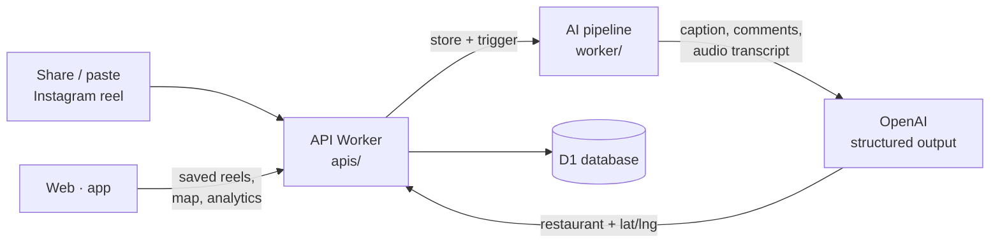

<div align="center">

# 🍜 Theeta

### Turn food reels into real, mapped restaurants.

Save the Instagram food reels you love — Theeta's AI resolves the **exact restaurant**
and pins it on your personal map, ready when the craving hits.

[theeta.in](https://theeta.in) · [Download the app](app/releases/README.md)

</div>

---

## The problem

We all share food reels with friends. But when it's actually time to *go*:

1. **You share it** — a friend drops a mouth-watering reel; you save it for "someday".
2. **You can't find it** — someday comes, and you're digging through captions, comments
   and DMs for a location that's barely there.
3. **You can't trust it** — half the spots are paid promos or staged hype. Was the food even real?

**Theeta solves step one first:** every reel you save is auto-resolved to the real
restaurant and dropped on your map. Trust scoring for fake hype and paid promos is next.

## How it works



1. A reel is shared from the **mobile app** or pasted on the **web** → `POST /api/reels`.
2. The **API Worker** (`apis/`) stores it and triggers the **AI pipeline** (`worker/`).
3. The pipeline pulls caption + comments with `yt-dlp`, asks **OpenAI** (structured output)
   for the restaurant/location, and — only if text isn't enough — transcribes the audio
   with `faster-whisper` and retries.
4. The resolved restaurant (name, address, lat/lng, confidence) is written back and the
   reel flips to **complete**.
5. The user sees the spot on their **map**, **list**, and **analytics**.

## Project structure

```
theeta/
├── apis/        API Worker — Hono on Cloudflare Workers + D1 (auth, reels,
│                restaurants, saves, lists). The orchestrator.
├── worker/      AI pipeline — FastAPI (Python). yt-dlp + OpenAI + faster-whisper
│                resolve a reel to a real restaurant + location.
├── web/         Web app — Nuxt 3 (Cloudflare). Marketing landing + dashboard,
│                map, analytics, profile, email/password + Google auth.
├── app/         Mobile app — Flutter (iOS + Android). Share-to-save, map,
│                analytics, profile. Prebuilt APKs in app/releases/.
├── docs/        API + deployment docs (api.md, docker.md).
├── docker-compose.yml        Local orchestration of all services.
└── run-ngrok.sh              Expose the local stack for device testing.
```

## Tech stack

| Layer | Tech |
|-------|------|
| API | Cloudflare Workers, [Hono](https://hono.dev), D1 (SQLite), R2 (media) |
| AI pipeline | FastAPI, OpenAI (structured outputs), faster-whisper, yt-dlp |
| Web | Nuxt 3, Vue 3, Leaflet (OpenStreetMap) |
| Mobile | Flutter (Dart), flutter_map |
| Auth | Email/password (PBKDF2) + Google OAuth → session tokens in D1 |

## Getting started

Spin up the whole stack locally with Docker:

```bash
cp .env.example .env   # fill in OPENAI / GOOGLE / service tokens
docker compose up
```

Or run a single component — see each folder's README:

- **API:** [`apis/README.md`](apis/README.md) — `npm run dev` (Wrangler) + D1 migrations
- **AI pipeline:** [`worker/README.md`](worker/README.md) — FastAPI service
- **Web:** `cd web && npm run dev` → http://localhost:3000
- **Mobile:** [`app/README.md`](app/README.md) — `flutter run` with `--dart-define=THETA_API_BASE=...`

## Downloads

Prebuilt Android APK: [app/releases/theeta-1.0.0.apk](app/releases/theeta-1.0.0.apk)
(see [release notes](app/releases/README.md)).

## License

[MIT](LICENSE) © Theeta
