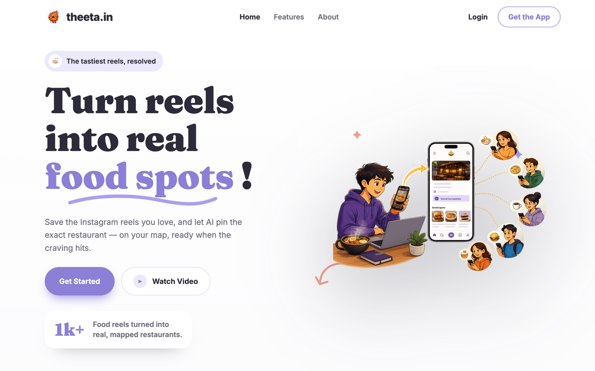
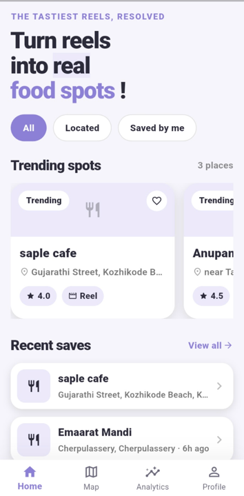

<div align="center">
  

# Theeta

### Turn food reels into real, mapped restaurants.

[theeta.in](https://theeta.in) · [Download the Android app](app/releases/theeta-1.0.0.apk)

</div>

---

## Overview

Theeta is a food‑discovery app for the way people actually find places to eat today — through
Instagram reels. You save (or share) a food reel, and Theeta's AI watches it, figures out the
**exact restaurant**, and drops it on your personal map and list. It ships as a **web app** and a
**Flutter mobile app** on one shared backend.

## Problem Statement

We all swap food reels with friends — but the moment you actually want to *go*:

1. **You share it** — a friend drops a mouth‑watering reel; you save it for "someday".
2. **You can't find it** — someday comes and you're digging through captions, comments and DMs for
   a location that's barely there.
3. **You can't trust it** — half the spots are paid promos or staged hype. Was the food even real?

The reel was perfect; the plan falls apart.

## Solution

Theeta kills the worst part first — the endless hunt. Save a reel and the pipeline automatically:

- pulls the caption + comments,
- asks an LLM (structured output) for the restaurant and location,
- transcribes the audio only when text isn't enough,
- writes back the resolved restaurant with address, lat/lng and a confidence score.

The spot then lands on your **map**, **list**, and **analytics** — ready when the craving hits.
Trust scoring for fake hype and paid promos is the next milestone.

## Features

- **Save by share or paste** — share an Instagram reel straight to Theeta, or paste a link.
- **AI restaurant resolution** — caption + comments + audio transcript → exact restaurant + coordinates.
- **Personal map** — every resolved spot pinned on an interactive map (Leaflet / OpenStreetMap).
- **Analytics** — saved, resolved, processing, top cities, resolution confidence.
- **Everyone vs. mine** — browse your own saves by default, or discover what everyone saved.
- **Cross‑platform** — Nuxt web app + Flutter mobile app (iOS/Android) on one API.
- **Auth** — email/password (PBKDF2) and Google OAuth, with shared sessions.

## Tech Stack

- **Frontend:** Nuxt 3 / Vue 3 (web), Flutter / Dart (mobile), Leaflet + OpenStreetMap, flutter_map
- **Backend:** Hono on Cloudflare Workers (API + auth/orchestration); FastAPI (Python) AI pipeline
- **Database:** Cloudflare D1 (SQLite) + R2 (media storage)
- **APIs:** OpenAI (structured outputs), faster‑whisper (audio transcription), yt‑dlp (reel extraction), Google OAuth, Google Places/Maps
- **Hosting:** Cloudflare Workers (API + web), containerized FastAPI worker

## Codex / OpenAI Usage

OpenAI is both **inside the product** and **part of how we built it**.

**In the product (core feature):**
- **Structured Outputs** turn a reel's caption + comments (and, when needed, the audio transcript)
  into a typed restaurant/location object — name, branch, area, city, suggested address, lat/lng and
  a confidence score — so resolution is deterministic and parseable (`worker/`).
- **faster‑whisper** transcribes reel audio only when text evidence isn't confident enough, then the
  model re‑runs on the richer evidence.

**During the build:**
- **Ideation & architecture** — shaping the reel → AI → restaurant pipeline and the Workers + D1 + FastAPI split.
- **Code generation** — scaffolding API routes, the Flutter UI, and the Nuxt landing/app pages.
- **Debugging** — iOS signing / Google Sign‑In config, Cloudflare/Nuxt build issues, SQL query fixes.
- **Documentation** — this README, per‑service docs, and release notes.

## Demo

> 📹 Demo / pitch video: _add link here_

## Screenshots

| Landing | App preview                               |
|---------|-------------------------------------------|
| Web     |   |
| APP     |  |


> Add more screenshots (map, dashboard, analytics) here.

## How to Run Locally

```bash
git clone https://github.com/ariyaam-project/theeta.in.git
cd theeta.in
```

**Everything at once (Docker):**

```bash
cp .env.example .env   # add OPENAI / GOOGLE / service tokens
docker compose up
```

**Or run a single component:**

```bash
# Web app  → http://localhost:3000
cd web && npm install && npm run dev

# API (Cloudflare Worker + D1)
cd apis && npm install && npm run dev        # see apis/README.md

# AI pipeline (FastAPI)
cd worker && pip install -r requirements.txt # see worker/README.md

# Mobile app
cd app && flutter run --dart-define=THETA_API_BASE=https://auth.theeta.in
```

See [`apis/README.md`](apis/README.md), [`worker/README.md`](worker/README.md) and
[`app/README.md`](app/README.md) for per‑service setup.

## License

[MIT](LICENSE) © Theeta
